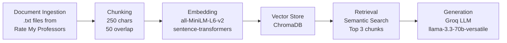

# Project 1 Planning: The Unofficial Guide

> Write this document before you write any pipeline code.
> Your spec and architecture diagram are what you'll use to direct AI tools (Claude, Copilot, etc.) to generate your implementation — the more specific they are, the more useful the generated code will be.
> Update the Retrieval Approach and Chunking Strategy sections if you change your approach during implementation.
> Update this file before starting any stretch features.

---

## Domain

<!-- What domain did you choose? Why is this knowledge valuable and hard to find through official channels? -->
University of Chicago student-generated knowledge about professors, 
sourced from Rate My Professors. This knowledge is valuable because 
official channels don't tell you how a professor actually teaches, 
grades, or treats students — only students who've taken the class know.

---

## Documents

<!-- List your specific sources: URLs, subreddit names, forum threads, or file descriptions.
     Aim for at least 10 sources that together cover different subtopics or perspectives within your domain. -->

| # | Source | Description | URL or location |
|---|--------|-------------|-----------------|
| 1 | Rate My Professors| Rating Professors | /documents/Michael RoloffLand.txt|
| 2 | Rate My Professors| Rating Professors | /documents/Faisal AkkawiLand.txt|
| 3 | Rate My Professors| Rating Professors | /documents/SheeWuLand.txt|
| 4 | Rate My Professors| Rating Professors | /documents/FangPei CaiLand.txt|
| 5 | Rate My Professors| Rating Professors | /documents/Sabri CetinkuntLand.txt|
| 6 | Rate My Professors| Rating Professors | /documents/Peter Ganong.txt|
| 7 | Rate My Professors| Rating Professors | /documents/Victor LimaLand.txt|
| 8 | Rate My Professors| Rating Professors | /documents/Stuart GazesLand.txt|
| 9 | Rate My Professors| Rating Professors | /documents/Kale DaviesLand.txt|
| 10| Rate My Professors| Rating Professors | /documents/Beatrice FineschiLand.txt|

---

## Chunking Strategy

<!-- How will you split documents into chunks?
     State your chunk size (in tokens or characters), overlap size, and explain why those
     numbers fit the structure of your documents.
     A review-heavy corpus warrants different chunking than a long FAQ. -->

**Chunk size:**
250

**Overlap:**
50

**Reasoning:**
Individual student reviews are typically 50-200 characters long. 
A 250-character chunk keeps each review mostly intact as its own 
semantic unit, avoiding mixing opinions about different aspects 
(grading, teaching style, difficulty) into a single chunk. This 
makes retrieval more precise — a question about grading should 
return chunks about grading, not chunks that mix grading and 
teaching comments together. Overlap of 50 characters preserves 
context at chunk boundaries where a review might split.
---

## Retrieval Approach

<!-- Which embedding model are you using (e.g., all-MiniLM-L6-v2 via sentence-transformers)?
     How many chunks will you retrieve per query (top-k)?
     If you were deploying this for real users and cost wasn't a constraint, what tradeoffs
     would you weigh in choosing a different embedding model — context length, multilingual
     support, accuracy on domain-specific text, latency? -->

**Embedding model:**

**Top-k:**

**Production tradeoff reflection:**

---

## Evaluation Plan

<!-- List your 5 test questions with their expected correct answers.
     Questions should be specific enough that you can judge whether the system's response
     is right or wrong. "What are good dining halls?" is too vague.
     "What do students say about wait times at [dining hall name] during lunch?" is testable. -->

| # | Question | Expected answer |
|---|----------|-----------------|
| 1 | How is Faisal Akkawi rated?|Faisal Akkawi is rated well He has a rating of 3.3. He teaches real world situation |
| 2 | How is SheeWu rated? |SheeWu is not rated very well He has a rating of 2.2 out of 5. She manipulates you into unhealthy practice |
| 3 | Who is rated more than 3 out of 5 |Faisal Akkawi and KaleDavies |
| 4 | Who has the lowest rating|Peter Ganong |
| 5 | Who has the highest rating|Beatrice Fineshi |

---

## Anticipated Challenges

<!-- What could go wrong? Name at least two specific risks with reasoning.
     Consider: noisy or inconsistent documents, missing source attribution, off-topic
     retrieval, chunks that split key information across boundaries. -->

1.

2.

---

## Architecture

---

## AI Tool Plan

<!-- For each part of the pipeline below, describe:
     - Which AI tool you plan to use (Claude, Copilot, ChatGPT, etc.)
     - What you'll give it as input (which sections of this planning.md, which requirements)
     - What you expect it to produce
     - How you'll verify the output matches your spec

     "I'll use AI to help me code" is not a plan.
     "I'll give Claude my Chunking Strategy section and ask it to implement chunk_text()
     with my specified chunk size and overlap" is a plan. -->

**Milestone 3 — Ingestion and chunking:**

**Milestone 4 — Embedding and retrieval:**

**Milestone 5 — Generation and interface:**
